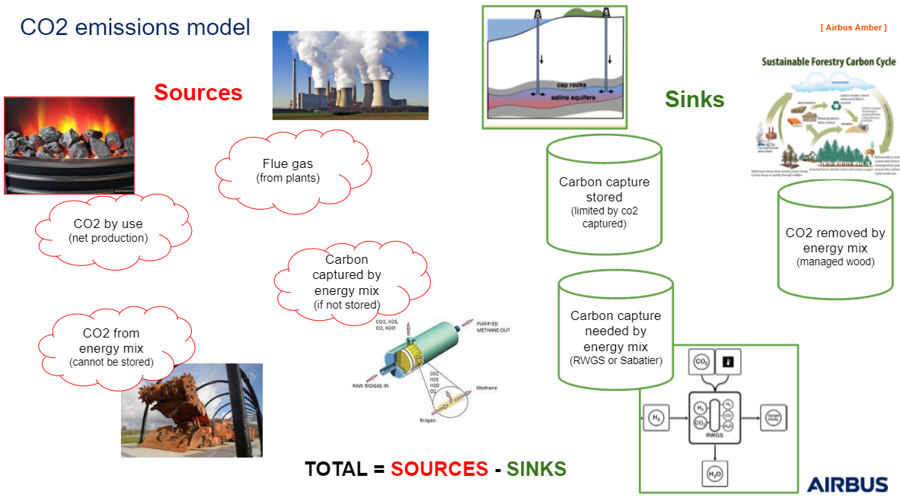

# Energy Green House Gases Emissions 

The objective of the model is to aggregate the information of GHG emissions coming from each energy.

## CO2 emissions model 

The CO2 emissions model is particular because it takes into account CO2 used or captured by CCUS technologies.

Four main sources are taken into account : 
- The CO2 in the flue gas expelled from plants (like coal generation plants)
- The CO2 emitted by the use of each net energy production (energy burned)
- The CO2 emitted by technos that cannot be stored, from machinery which uses fuels (tractors for biomass, coal extractors ...)
- The CO2 which is captured by technologies as Upgrading biogas for example
  
Other technologies acts in the favor of the removal of carbon emissions and CO2 fluxes are divided in three categories : 
- The CO2 fluxes stored by carbon storage technologies (i.e. injected in oceans)
- The CO2 removed by technologies (i.e. managed wood technology removes CO2 thanks to tree carbon cycle)
- The CO2 needed by the chemical reaction of a technology (i.e. Fischer Tropsch plants may needs CO2 to enrich syngas in CO for Fischer Tropsch synthesis)
  

## Other GHG emissions model 

The other models are taking into account two sources of GHG emissions: 
- The GHG emissions coming from technologies (CH4 leakage in coal mines, N2O leakage when oil is burned in oil-fired electricity plants)
- The GHG emissions coming from the use (burning) of fossil fuel are biomass dry net production.

