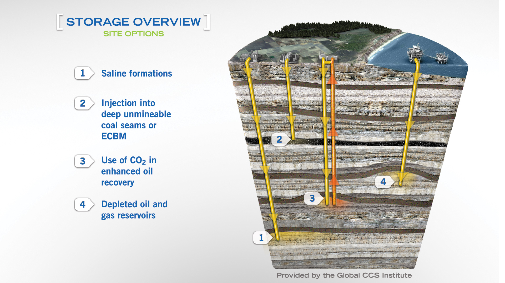

**Definition (extracted from [^1]):**
Carbon Capture and Storage (CCS) is the process of capturing waste carbon dioxide ($CO_2$), transporting it to a storage site, and depositing it where it will not enter the atmosphere. Usually the $CO_2$ is captured from large point sources, such as a cement factory or biomass power plant, and normally it is stored in an underground geological formation. The aim is to prevent the release of large quantities of $CO_2$ into the atmosphere from heavy industry, and so help to limit climate change. Although $CO_2$ has been injected into geological formations for several decades for various purposes, including enhanced oil recovery, the long-term storage of $CO_2$ is a relatively new concept.

There exist several paths for storage:

* Depleted Oil & Gas
* Enhanced Oil recovery
* Deep saline formation
* Deep ocean $CO_2$ injection
* $CO_2$ geologic mineralization through $CO_2$ dilution in water
* Biomass burying and fossilization
* Pure carbon solid storage

[^1]: https://en.wikipedia.org/wiki/Carbon_capture_and_storage
[^2]: [Global CCS institute - CCS Image Library](https://www.globalccsinstitute.com/resources/ccs-image-library/)
