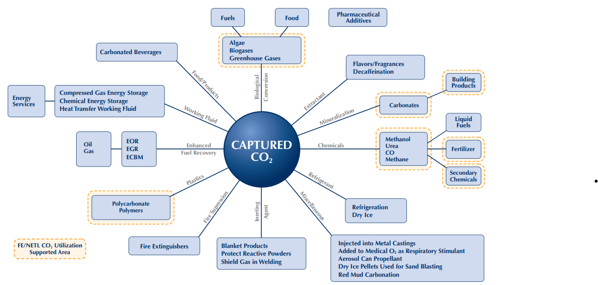
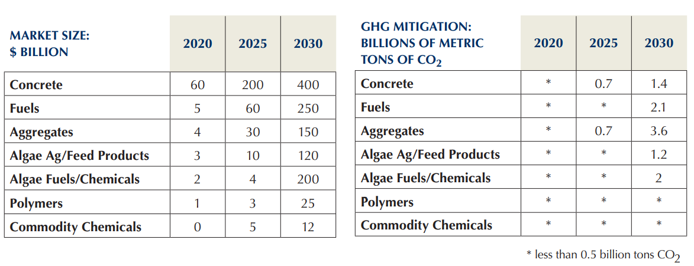

# Carbon Utilization:
Captured carbon can used either to produce oil from depleted wells through the enhanced oil recovery (EOR) process, or in the creation of a variety of products. Utilization of captured carbon, which offers the potential to significantly contribute to greenhouse gas emissions reduction. Pathways include the production of construction materials, fuels, plastics, chemicals, and algae-based products (e.g., fuels, animal feed, and fertilizers), food production.

The Global CO2 Initiative Roadmap (2016) provided a useful projection of how carbon utilization could grow in coming years if certain scenarios and assumptions are realized. To provide insight into what full potential might look like, the Roadmap lays the ground work for what might be considered high-end markers for the potential of carbon utilization moving forward. A significant conclusion summarized from the report was that, “Funding, incentives and prompt strategic action are necessary to move the CBPI [Carbon Based Products Industry] to its full potential... [at which] CBPI could reach or exceed US $800 billion by 2030.”

There exist several paths for utilization [^1]:

* Food/Products
  * Carbonated beverages
  * Carbonated water
* Agriculture & Food
  * Algae-based food or animal feed
  * Microbial fertilizer
  * Biochar, bio-pesticides, bio-cosmetics
* Industrigas & Fluids
  * Enhanced oil recovery
  * Enhanced coal bed methane recovery
  * Enhanced water recovery
  * Semiconductor fabrication
  * Power cycles
* Construction Materials
  * Cement and Concrete
  * Asphalt
  * Aggregate
  * Timber/super hardwood
* Fuel
  * Synthetic (methanol, butanol,natural gas, syngas, etc)
  * Micro-algae fuel
  * Macro-algae fuel
* Plastics
  * Polyurethane foams
  * Polycarbonate(glass replacement)
  * Acrylonitrile butadiene styrene
* Chemicals
  * Preservatives (formic acid)
  * Medicinal
  * Antifreeze (ethylene glycol)
  * Carbon black
* New Materials
  * Carbon Fiber
  * Carbon nanotubes and fullerenes
  * Graphene

[^1]: [Carbon utilization](https://www.c2es.org/wp-content/uploads/2019/09/carbon-utilization-a-vital-and-effective-pathway-for-decarbonization.pdf)

